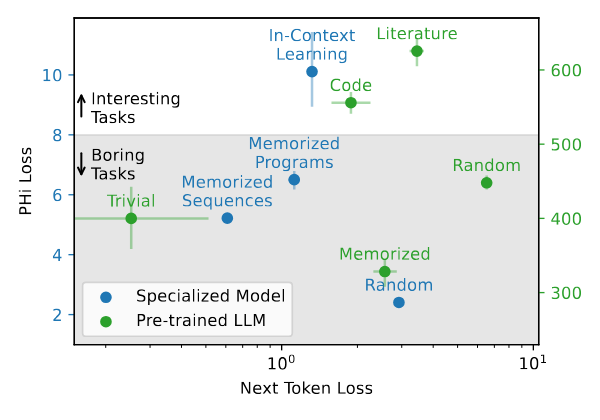

This repository contains the official implementation for the ICML 2025 paper [Measuring In-Context Computation Complexity via Hidden State Prediction](https://arxiv.org/abs/2503.13431).

We introduce the PHi (**P**rediction of **Hi**dden states) loss, a metric to quantify the "interestingness" of computation in neural sequence models by measuring the predictability of their hidden states. 
It can also be interpreted as the information gain at each sequence step.
This code allows you to train models with the PHi layer and reproduce the key findings from our paper.

A PHi layer can be inserted into any neural sequence model, such as Transformers or LSTMs, trained from scratch or pre-trained (we demonstrate this with Llama 3.2 3B).
It inserts an information bottleneck into the main pathway of the model, allowing to quantify the predictability of the hidden states at each sequence step.


## Main Findings:

- Interesting tasks like in-context learning, or modeling code and literature, lead to high PHi loss.
  Trivial or boring tasks like retrieving memorized sequence or modeling random structureless data, lead to low PHi loss.
  For next token prediction loss, there is no clear relationship to task interestingness.

  
- There is a strong correlation between PHi loss and the amount of in-context computation required by the model to solve the task, even when controlling for the next token prediction loss.

  
- For LLM-generated rationales for mathematical reasoning tasks, high PHi loss is predictive of correct solutions. 
  This is especially pronounced for difficult problems. 
  The intuition is that difficult problems require interesting solutions. More details in the paper.

  

### Prerequisites:
- Python 3.10+
- PyTorch 2.1+
- A [WandB](https://wandb.ai) account for experiment tracking (optional)
- A [huggingface](https://huggingface.co) account for downloading datasets and checkpoints
- A single GPU with at least 24GB of memory (e.g., NVIDIA RTX 3090/4090).

## Installation

1. Clone the repository:
```Bash
git clone https://github.com/your-username/self-predicting-models.git
cd self-predicting-models
```

2. Install the required dependencies. The code uses torchtune for efficient training.
```Bash
pip install -r requirements.txt
```

## Training

We provide configuration files to replicate the main experiments in the paper. Necessary datasets and checkpoints are downloaded automatically from Hugging Face.

### Specialized Models (From Scratch)

Train a 12-layer Transformer (0.1B parameters) on the in-context language learning task:
```bash
tune run training.py --config configs/transformer_pfa_0_1B_PHi.yaml
```

Train a 2-layer LSTM (0.1B parameters) on the same task:
```bash
tune run training.py --config configs/lstm_pfa_0_1B_PHi.yaml
```

### Pre-trained LLM (Llama 3.2 3B)

Train a PHi layer inserted into a pre-trained, instruction-tuned Llama 3.2 3B model. 
The base model weights are frozen. 
For convenience, we include the [GSM-8k](https://github.com/openai/grade-school-math) and [MATH](https://github.com/hendrycks/math) datasets in the repository.

```bash
tune run training.py --config configs/llama_3_2_3B_PHi.yaml
```

For a quick testing and debugging, use the training script:
```bash
python training_script.py
```

## Citation

If you use this code or our findings in your research, please cite our paper:
```bibtex
@misc{herrmann2025measuring,
  title={Measuring In-Context Computation Complexity via Hidden State Prediction},
  author={Herrmann, Vincent and Csord{\'a}s, R{\'o}bert and Schmidhuber, J{\"u}rgen},
  year={2025},
  eprint={2503.13431},
  archivePrefix={arXiv},
  primaryClass={cs.LG},
  url={https://arxiv.org/abs/2503.13431}, 
}
```

